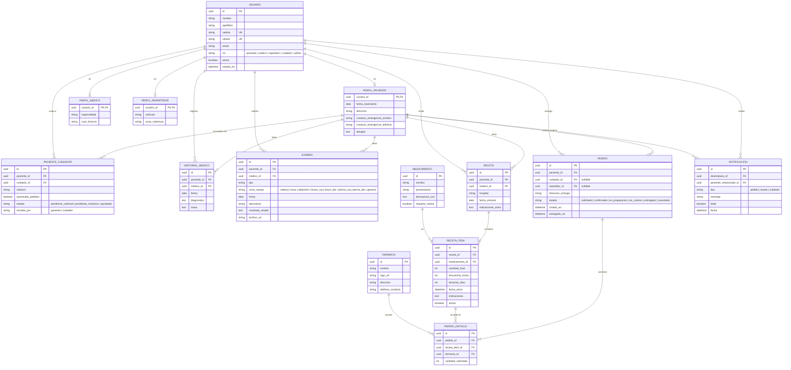

# Diagrama ER — MediSalud

Esquema completo de base de datos (PostgreSQL), 14 tablas. Este archivo usa
sintaxis [Mermaid](https://mermaid.js.org/) — se renderiza automáticamente
al verlo en GitHub.

## Notas de diseño (por qué quedó así)

- **`PERFIL_PACIENTE` / `PERFIL_MEDICO` / `PERFIL_REPARTIDOR`** son 1—1 con `USUARIO`
  (no todos los campos aplican a todos los roles).
- **`RECETA` / `RECETA_ITEM`**: una receta es un documento (médico, hospital, fecha)
  que puede contener varios medicamentos. La disponibilidad de cada medicamento
  se calcula en el cliente a partir de `RECETA_ITEM`, nunca se guarda como
  columna fija.
- **`PEDIDO_DETALLE.receta_item_id`**: un pedido reabastece ítems específicos,
  no documentos completos de receta.
- **`PACIENTE_CUIDADOR`**: la vinculación puede iniciarla el paciente o el
  cuidador (`iniciado_por`), y queda pendiente hasta que la otra parte confirma.
- **`NOTIFICACION`** solo guarda tipos `pedido`, `receta` y `cuidador`. Los
  recordatorios de medicina (`recordatorio`) viven exclusivamente en IndexedDB
  del navegador y nunca tocan esta tabla — ver `frontend/src/offline/`.
